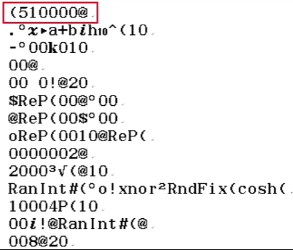

# 像素编辑器

在开始「像素编辑器」注入之前，请确保你对计算器已经有了基本的了解 ~~，你至少应该知道怎么开机关机，怎么打字，怎么打黄色和红色的字符，这些基础的东西在这里并不赘述~~。

::: tip
这篇教程只提供方法的指导而没有原理的解析，原理的解析将会在之后补充进来。我们也期待大家共建这一篇教程，欢迎到 [GitHub](https://github.com/KaguReion/Site1S8D27) 上为该项目提交 Issue 或 Pull Request，或者在 Discussions 区畅聊。
:::

准备好你的计算器，开机，坐定，确保你有一两个小时不间断的时间。接下来这段时间，让我们开启「像素编辑器」这一旅程吧 (●'◡'●)

## 重置并进入对应模式

### 重置计算器

> `SHIFT` `9` `3` `=` `AC`

### 进入「线性输入/线性输出」模式

> `SHIFT` `菜单` `1` `3`

### 进入 124an 模式

> `1` `SHIFT` `8` `↓` `2` `7` `=` `↑` `←` `SHIFT` `8` `↓` `2` `6` `←` `←` `→` `SHIFT` `.` `←` `.` `DEL` `←` `→` `SHIFT` `.` `→` `DEL` `DEL` `→` `←` `1` `DEL` `DEL` (键入任意 100 个数字) `+` (键入任意 23 个数字) `=`

## 注入 quickcpy

下面有两个表格，这两个表格至关重要。第一个表格在刷出不可刷字符的时候使用，我们称为 表 1。

| 注入字符串                           | 字符串中的十六进制字符 |
| ------------------------------------ | ---------------------- |
| $@ =10.00020D1A2301D:@ =10223$       | $@DAD@$                |
| $@ =10.00028D1A2301D:@ =1D2C423$     | $@DAD@DC$              |
| $@ =10.00030D1A2301D:@ =123$         | $@DAD@$                |
| $@ =10.00038D1A2301D:@ =11823$       | $@DAD@$                |
| $@ =10.0003CD1A2301D:@ =1010323$     | $@CDAD@$               |
| $@ =10.00044D1A2301D:@ =1248F0823$   | $@DAD@F$               |
| $@ =10.0004CD1A2301D:@ =1288F2423$   | $@CDAD@F$              |
| $@ =10.00054D1A2301D:@ =1C28F288F23$ | $@DAD@CFF$             |
| $@ =10.0005CD1A2301D:@ =11523$       | $@CDAD@$               |
| $@ =10.00064D1A2301D:@ =10E23$       | $@DAD@E$               |
| $@ =10.0006CD1A2301D:@ =1C2A28A23$   | $@CDAD@CAA$            |
| $@ =10.00074D1A2301D:@ =16123$       | $@DAD@$                |
| $@ =10.0007CD1A2301D:@ =120CC0623$   | $@CDAD@CC$             |
| $@ =10.00084D1A2301D:@ =11D23$       | $@DAD@D$               |

第二个在 strcpy 的时候使用，我们称为 表 2。

这里，我们用第 1 行作为示例并进行讲解。

::: tip
quickcpy 共有 14 行需要注入，每一行都需要经过所有的步骤，因此请保证你有足够的耐心。
:::

::: warning
请确保你充分理解了示例之后再开始注入！ ~~如果注入卡在一半的时候看不懂了可不要怪我~~
:::

我们已经进入了「线性输入/线性输出」模式和 124an 模式，现在我们开始注入第 1 行。

注入 quickcpy 的过程实际上就是不断进行 strcpy 的过程。在 strcpy 每一行之前，我们需要构造这一行的 strcpy 字符串，这个字符串包括前面一部分和后面一部分，后面这一部分是 strcpy 的内容。而 strcpy 字符串通常包括不可刷字符，因此，我们需要使用历史记录溢出的方法得到不可刷字符。

使用历史记录溢出的方法得到不可刷字符的确是一种好办法，但是在构造历史记录的时候，我们仍然需要十六进制字符的帮助。根据表 1，构造历史记录需要我们在屏幕上打出一段导致历史记录溢出的字符串，这一字符串的中间部分，「注入字符串」，如表 1 所示。我们注入的是第 1 行，查表可得第 1 行的注入字符串

$@ =10.00020D1A2301D:@ =10223$

所以，我们需要想办法把这个字符串打到计算器屏幕上。这个字符串中包含了十六进制字符，我们需要使用字符转换器得到它们。

::: warning
很多朋友可能会有疑问：比如说键入 $A$，为什么不用 `SHIFT` `(-)` 打出来，而用复杂的字符转换器得到它呢？

事实上，用 `SHIFT` `(-)` 得到的 A 是变量 A，但我们需要键入的字母 $A$ 并不是变量，而是一个特殊的十六进制字符。这两者之间不能划等号。要得到我们需要的字母，必须通过字符转换器实现。
:::

### 刷出十六进制字符

我们需要借助字符转换器的力量来刷出十六进制字符。按照以下步骤开启字符转换器：

> `1` `SHIFT` `8` `2` `7` `=` `↑` `←`

我们看到光标在 1 的前面闪烁，这便进入了字符转换器，且我们可以说光标目前所在的位置就是字符转换器能发挥作用的位置。所谓「字符转换器」，是一个能够转换字符的 BUG，借此我们可以刷出自己想要的十六进制字符。

我们需要刷出注入字符串 $@ =10.00020D1A2301D:@ =10223$，注意到这里需要用到的、不能直接输入的十六进制字符有 5 个，按照字符串中出现的顺序，它们分别是

$@$, $D$, $A$, $D$, $@$

::: tip
这里的左右两个 $@$ 并不一样，刷出它们的方法也不一样。
:::

我们很自然地想到，可以先利用字符转换器刷出这 5 个难刷的字符，剩下的字符直接打进去就可以了。

::: tip
我们需要对每一个字符完成一次刷入。由于字符转换器的特性，后一个刷出的字符总位于前一个刷出的字符的前面，这意味着我们需要将十六进制字符倒序刷进去。

假如我们需要刷第 2 行

$@ =10.00028D1A2301D:@ =1D2C423$

这里的十六进制字符有 6 个，分别是

$@$, $D$, $A$, $D$, $@$, $D$, $C$

我们就应当先刷 $C$，再刷 $D$，然后刷 $@$，紧接着 $A$, $D$，最后是 $@$。它们*在字符串中出现的顺序*和*刷入的实际顺序*是恰好颠倒的。
:::

为了方便大家操作，我们在第一个表格中给出了每一个注入字符串中包含的十六进制字符。现在让我们实践一下！

::: info
字符转换器的转换过程可以理解为基因工程中构建基因表达载体的过程，但我们在这里并不展开原理以具体说明。
:::

我们需要用一个替代字符来得到刷出字符。替代字符刷出的时候，光标必须处于字符转换器能发挥作用的位置。下表给出了替代字符的刷出步骤。

| 刷出字符             | 替代字符刷出步骤         |
| -------------------- | ------------------------ |
| 左侧 $@$（后刷出的） | `SHIFT` `7` `4` `8`      |
| $A$                  | `SHIFT` `7` `3` `7`      |
| $B$                  | `SHIFT` `7` `3` `8`      |
| $C$                  | `SHIFT` `7` `3` `9`      |
| $D$                  | `SHIFT` `7` `3` `(-)`    |
| $E$                  | `SHIFT` `7` `3` `°′″`    |
| $F$                  | `SHIFT` `7` `3` $x^{-1}$ |
| 右侧 $@$（先刷出的） | `SHIFT` `7` `4` `9`      |

我们共需要对 14 行分别进行这一个操作。当我们准备刷出一个字符的时候，我们一定希望，在刷字符开始的时候，光标处于字符转换器可发挥作用的位置；而刷完这个字符之后，光标也应该回到这个位置以便下次刷字符。事实上，我们也是这么做的。每一行的 strcpy 都是相互独立的。

假如我们开始对某一行进行 strcpy 了：如果我们现在要刷的字符是这一行我们刷入的第一个字符（也就是在字符串中出现的最后一个字符），我们需要遵循下面的做法：

> (替代字符刷出片段) `←` `←` `→`

::: tip
为什么需要后面那三步操作呢？因为我们需要让光标回到字符转换器发挥作用的位置，以便下一次刷入的进行。
:::

而刷入这一行后续的字符是这样操作的：

> (替代字符刷出片段) `←` `.` `DEL` `←` `→`

::: tip
后面那五步又是为什么呢？这是为了拼凑字符，同时让光标归位。具体的原理将在之后的更新中附带，现在我们只需要知道这样做就行了。
:::

刷完所有的字符后，光标位于所有刷出来的字符的左边和一个 1 和一个长得很奇怪的字符串

*t*ℓ&0&▒&₉◃₉◃E

的右边。按 `DEL` `DEL` 删掉这个字符串和前面的 1。恭喜你，刷出了这一行所有的十六进制字符！接下来，补全历史记录溢出所用的字符串就可以了。

很多朋友看到这里可能会一头雾水 ~~比如第一次学习到这里时的零音~~ 。不妨用详细的按键步骤来指导大家先完成一遍：

比如说，我们要刷出第 1 行，那么我们就应当先刷出 $@$, $D$, $A$, $D$, $@$ 这 5 个十六进制字符来。

::: warning
下文括号内的内容仅作步骤提示，不需要键入。
:::

> (进入字符转换器) `1` `SHIFT` `8` `2` `7` `=` `↑` `←`
>
> (刷出右侧$@$，这是字符串中最后一个字符，所以第一个刷进去) `SHIFT` `7` `4` `9` `←` `←` `→`
>
> (字符串从右往左，第二个是 $D$) `SHIFT` `7` `3` `(-)` `←` `.` `DEL` `←` `→`
>
> (接下来刷 $A$, $D$, 左侧$@$) `SHIFT` `7` `3` `7` `←` `.` `DEL` `←` `→` `SHIFT` `7` `3` `(-)` `←` `.` `DEL` `←` `→` `SHIFT` `7` `4` `8` `←` `.` `DEL` `←` `→`
>
> (清掉前面的 $1$ 和奇怪的字符串) `DEL` `DEL`

看到了吗？现在你的屏幕上应当显示 $@DAD@$ 才对。这样，我们就得到了所需要的十六进制字符。

### 补全历史记录溢出字符串

接下来就是把它补全成历史记录溢出字符串。我们当然可以补全注入字符串 $@ =10.00020D1A2301D:@ =10223$，但这还不够，我们需要再在这个注入字符串前面加上 $12345678x:$ 这样一段。也就是说，我们实际输入的是：

$12345678x:@ =10.00020D1A2301D:@ =10223$

这就是历史记录溢出所用的字符串。

现在光标在你的屏幕最前面，你可以这样补全这个字符串：

> `12345678` `x` `ALPHA` `∫` `→` `ALPHA` `CALC` `10.00020` `→` `1` `→` `2301` `→` `ALPHA` `∫` `→` `ALPHA` `CALC` `10223`

::: tip
这里的等于号 $=$ 使用 `ALPHA` `CALC` 得到，比号 $:$ 使用 `ALPHA` `∫`(积分符号) 得到。

每一个比号之后，计算器会换一行，也就是说我们的输入区应当有 3 行，但是第 2 行太长了，被截断成了两行，将 $D:$ 截断到了下一行去，因此我们看到的是四行。
:::

接下来，按 `CALC` `=` `=` `=`，再按 `↑`，看到心心念念的不可刷字符（们）了吗？你的计算器应当这样显示

$i\text{▶t}\text{xnor}0\text{@ \ \ @}$

这里，两个 $@$ 中间有 3 个空格。如果你的计算器没有这么显示（比如说显示的是 $8x$），那大概率是 124an 模式没有进入成功，按下 `开机` 键重来一遍吧。

### 补全 strcpy 字符串并注入

::: tip
按下 `←` 将光标移动到输入区最后面，惊奇地是，光标显示的位置竟然在 $@$ 的后面很多格。你可能会以为这中间隔着空格，但是千万不要这个时候按 `DEL`！否则，你会发现最后一个 $@$ 失踪了，它被删掉了。

事实上，这里的确存在空格，但是不在光标在屏幕上显示的位置和 $@$ 在屏幕上显示的位置中间，而恰恰在这个位置的前面。其实，两个 $@$ 中间夹着的空格，在屏幕上只占不到半个字符左右的位置，但是会让光标向后偏移一整个字符的位置，也就是说，光标在屏幕上的位置和光标在输入区的位置是错位的。

那怎么办呢？既然我们知道了第一个 $@$ 后面有 3 个空格，紧接着是第二个 $@$，而我们现在就在输入区最后面呢，我们当然可以 `←` `DEL` `DEL` `DEL` 删掉 3 个空格。

不过，这里仍然有一个更加 elegant 的小 trick：按 `←` 直到光标在第一个 $@$ 的末尾（在这里就是按 4 下 `←`，具体情况具体对待），使得空格都位于光标的后面（既然其他字符并不会引起错位，那我们知道，这个时候光标的确在所有空格的左边），然后按 3 下 `→`。现在光标所在的位置是三个空格之后，尽管屏幕上并不这么显示。按 3 下 `DEL`，这样就删掉了空格，光标实际所在的位置，就是两个 $@$ 的中间！

（在刚才如果你有留心，你会注意到，每一次 `DEL` 后，光标和后面的 $@$ 的移动速度是不一样的，这也印证了我们的观点。）

然后我们按 `↑` 让光标移动到输入区的最左边（一般建议多按几次 `↑`，因为在这里光标所处的位置是第 1 行，所以按 1 次就能回位。但下面的步骤里，有很多情况下光标不在第 1 行，我们需要多按几次），
:::

删除掉输入区中冗余的 3 个空格之后，接下来我们需要将 strcpy 字符串补全。

::: warning
请注意，我们在这里只删除冗余的 3 个空格而非所有空格！在注入第 5 行的 strcpy 字符串的时候，我们会在 strcpy 内容的 3 个 $0$ 的后两个之间留下 1 个空格，**这个空格必须保留**。
:::

我们向输入区里填充剩下的字符。补全之后的输入区应当是这样

(48 个数字) $\text{k}010$ (第 1 个刷出的字符) $\text{!⌟▶t00xnor}^2\cosh^{-1}\text{()008@20003:}$ (strcpy 片段参考表所示内容)

比如说我们刷出了 $i\text{▶t}\text{xnor}0\text{@@}$，那么「第 1 个刷出的字符」就是 $i$，又查表得到第 1 行的「strcpy 片段参考表所示内容」就是 $(510000@$ 所以我们补全之后的样子就是

(48 个数字) $\text{k}010\text{i!⌟▶t00xnor}^2\cosh^{-1}\text{()008@20003:(510000@}$

::: tip
在这里，$\text{k}$ 是工程符号 k，使用 `OPTN` `3` `6` 刷出；$\cosh^{-1}$ 是双曲函数，用 `OPTN` `1` `5` 得到。
:::

例如，当你得到了 $i\text{▶t}\text{xnor}0\text{@@}$ 之后，确保光标在最前面，然后进行下面的操作补全 strcpy 字符串：

> `123456789012345678901234567890123456789012345678` (48 个数字，此时光标距离这一行末尾还有 3 格) `OPTN` `3` `6` `010` (光标离这一行开头有 1 格) `→` `SHIFT` $x^{-1}$ `分数线` `→` `00` `→` $x^2$ `OPTN` `1` `5` `)` `→` `08` `→` `20003` `ALPHA` `∫` `(` `510000`

补全结束后，按 `↓` 将光标移动到输入区的最右端（同样建议多按几次），然后重重地按下 `=`，之后按 `AC`。

::: warning
你会发现按下 `=` 后，计算器并没有什么反应。这是正常的。你只需要确保你按下了 `=` 即可。

但是，请不要因此连续敲击 `=`，这并非一个好习惯——在后续注入主程序过程中，一次 `=` 伴随着地址的向后改变，因此如果你对一次注入连续敲击了多个 `=`，就会导致本应只存在于一处的内容被注入了接连不断的后续的地方，这就出问题了。
:::

恭喜你！第 1 行 quickcpy 注入成功！现在你只需要做的是，彻底搞懂上面这些内容之后，把上面的每一步都一丝不苟地做 14 遍，将 quickcpy 整个注入到你的计算器里。这个过程可能会很艰难，零音在这里为你加油 ヾ(•ω•`)o

::: tip

1. 如果你在注入某一行的过程中卡住了，那么大概率是之前的某一行或某几行注入出错了。或许你需要从头再来一次。
2. 如果你不幸在注入过程中关闭了计算器，或者计算器在 10min 无操作后自动关闭，则你通常需要重新进入一次 124an 模式，但已经注入的行不需要重复注入——我们在这一步和下面那些步骤中注入的内容，在计算器开机的时候不会被刷写掉。但如果你卸下电池，那么情况就不一样了。

:::
